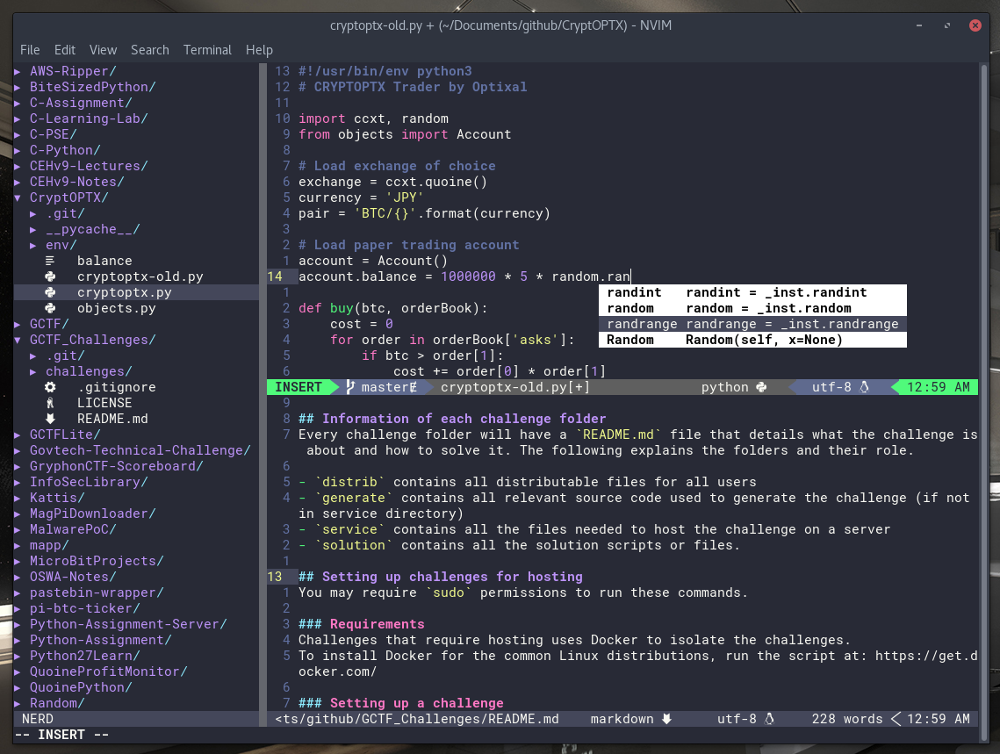

# Optixal's Neovim init.vim



## Installing and Updating

### Install

```sh
# Install nvim, pip3 and git
sudo apt install nvim python3-pip git

# Install pip modules for Neovim
pip3 install --user neovim jedi psutil setproctitle

# Install vim-plug plugin manager
curl -fLo ~/.local/share/nvim/site/autoload/plug.vim --create-dirs https://raw.githubusercontent.com/junegunn/vim-plug/master/plug.vim

# Make config directory for Neovim's init.vim
mkdir -p ~/.config/nvim

# Soft link the init.vim in current working directory to nvim's config location. Or simply `cp init.vim ~/.config/nvim/`
ln -sf $(readlink -f init.vim) ~/.config/nvim/.

# (Optional but recommended) Install a nerd font for icons and a beautiful airline bar (https://github.com/ryanoasis/nerd-fonts/tree/master/patched-fonts) (I'm using Roboto Mono Nerd Font Complete) (remember to change terminal font to Roboto Mono, or whichever patched font you've picked!)
curl -fLo ~/.local/share/fonts/Roboto\ Mono\ Nerd\ Font\ Complete.ttf --create-dirs https://github.com/ryanoasis/nerd-fonts/raw/master/patched-fonts/RobotoMono/complete/Roboto%20Mono%20Nerd%20Font%20Complete.ttf

# (Optional) Alias vim -> nvim
echo "alias vim='nvim'" >> ~/.bashrc

# Enter Neovim and install plugins
nvim
:PlugInstall
:qa! # Quit All Force (no save). Useful when dealing with multiple split windows.
```

### Update

```sh
# (Optional) Pull my updates if you want my new modifications
git pull

# Update the plugins (super simple)
nvim
:PlugUpdate

# (Optional) Clean plugins - Deletes unused plugins
:PlugClean

# (Optional) Check, download and install the latest vim-plug updates
:PlugUpgrade
```

## Note

### For Non-GUI Users

* Colorschemes may not be rendered
* Changing fonts may be harder (https://unix.stackexchange.com/a/49823), if you can't be bothered, you should uncomment the devicons plugin within "init.vim" (`" Plug 'ryanoasis/vim-devicons'`)

### Mapped Commands in Normal Mode

* `,` Map Leader
* `,f` Sidebar filetree viewer (NERDTree)
* `,c<Space>` Toggle comment for current line (Nerd Commenter)

More commmands at https://github.com/Optixal/.vim/blob/master/reference/commands_vim.txt

