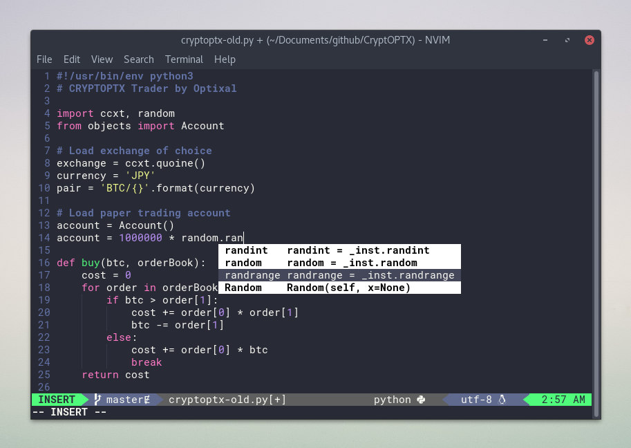
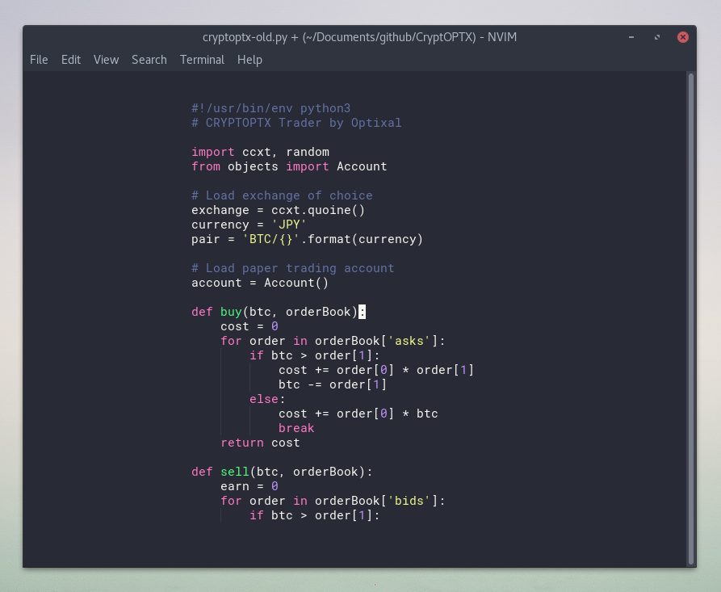
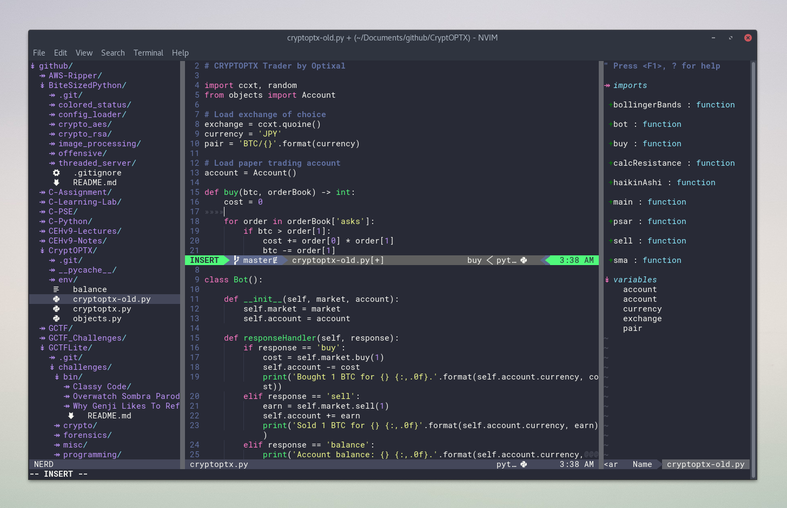

# Optixal's Neovim init.vim

Normal usage.



Minimal, focussed sessions with Goyo.



Multi-windowed editing with NerdTree and TagBar sidebars.



## Installing and Updating

### Install

```sh
# Install nvim (and its dependencies: pip3, git) and ctags (for tagbar)
sudo apt install neovim python3-pip git exuberant-ctags -y

# Install pip modules for Neovim
pip3 install --user neovim jedi psutil setproctitle

# Install vim-plug plugin manager
curl -fLo ~/.local/share/nvim/site/autoload/plug.vim --create-dirs https://raw.githubusercontent.com/junegunn/vim-plug/master/plug.vim

# Make config directory for Neovim's init.vim
mkdir -p ~/.config/nvim

# Soft link the init.vim in current working directory to nvim's config location. Or simply `cp init.vim ~/.config/nvim/`
ln -sf $(readlink -f init.vim) ~/.config/nvim/.

# (Optional but recommended) Install a nerd font for icons and a beautiful airline bar (https://github.com/ryanoasis/nerd-fonts/tree/master/patched-fonts) (I'll be using Roboto Mono for Powerline)
curl -fLo ~/.local/share/fonts/Roboto\ Mono\ Nerd\ Font\ Complete.ttf --create-dirs https://github.com/ryanoasis/nerd-fonts/raw/master/patched-fonts/RobotoMono/complete/Roboto%20Mono%20Nerd%20Font%20Complete.ttf

# (Optional) Alias vim -> nvim
echo "alias vim='nvim'" >> ~/.bashrc

# Enter Neovim and install plugins
nvim
:PlugInstall
:qa! # Quit All Force (no save). Useful when dealing with multiple split windows.
```

Alternatively, run `./install.sh`.

### Update

```sh
# (Optional) Pull my updates if you want my new modifications
git pull

# Update the plugins (super simple)
nvim
:PlugUpdate

# (Optional) Clean plugins - Deletes unused plugins
:PlugClean

# (Optional) Check, download and install the latest vim-plug updates
:PlugUpgrade
```

## Note

### For Non-GUI Users

* Colorschemes may not be rendered
* Changing fonts may be harder (https://unix.stackexchange.com/a/49823), if you can't be bothered, you should uncomment the devicons plugin within "init.vim" (`" Plug 'ryanoasis/vim-devicons'`)

### Mapped Commands in Normal Mode

Most custom commands expand off my map leader, keeping nvim as vanilla as possible.

* `,` - Map leader, nearly all my custom mappings starts with pressing the comma key
* `,q` - Sidebar filetree viewer (NERDTree)
* `,w` - Sidebar classes, functions, variables list (TagBar)
* `\`  - Toggle both NERDTree and TagBar
* `,ee` - Change colorscheme (with fzf fuzzy finder)
* `,ea` - Change Airline theme
* `,e1` - Color mode: Dracula (Dark)
* `,e2` - Color mode: Seoul256 (Between Dark & Light)
* `,e3` - Color mode: Forgotten (Light)
* `,e4` - Color mode: Zazen (Black & White)
* `,r` - Refresh/source ~/.config/nvim/init.vim
* `,t` - Trim all trailing whitespaces
* `,a` - Auto align variables (vim-easy-align), eg. do `,a=` while your cursor is on a bunch of variables to align their equal signs
* `,s` - New terminal in horizontal split
* `,vs` - New terminal in vertical split
* `,d` - Automatically generate Python docstrings while cursor is hovering above a function or class
* `,f` - Fuzzy find a file (fzf)
* `,g` - Toggle Goyo mode (Goyo), super clean and minimalistic viewing mode
* `,h` - Toggle rainbow parentheses highlighting
* `,l` - Toggle Limelight mode (Limelight), highlight the lines near cursor only
* `,j` - Set filetype to "journal" which makes the syntax highlighting beautiful when working on regular text files and markdown
* `,n` - Hackernews vertical windows (requires internet) (vim-hackernews)
* `,c<Space>` - Toggle comment for current line (Nerd Commenter)
* `<Tab>` - Next buffer
* `<Shift-Tab>` - Previous buffer

More commmands at https://github.com/Optixal/.vim/blob/master/reference/commands_vim.txt

